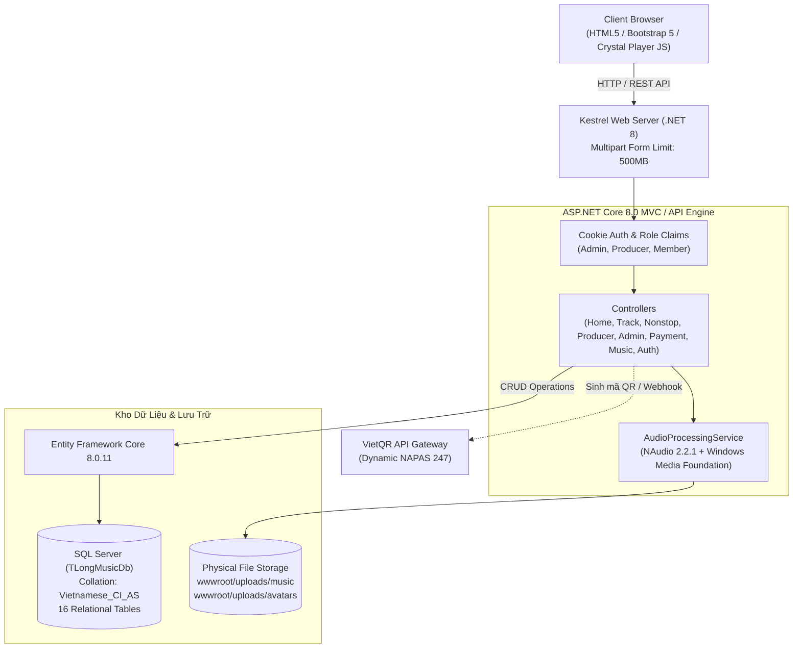
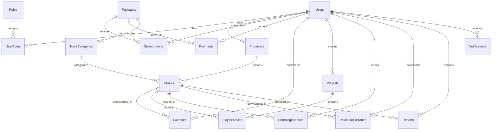

# 🎵 TLONGMUSIC - NỀN TẢNG MUSIC POOL & PHÂN PHỐI ÂM NHẠC DJ CHUYÊN NGHIỆP

<p align="center">
  
</p>

<p align="center">
  <strong>Hệ thống phân phối, phát trực tuyến và chia sẻ âm nhạc điện tử, Vinahouse, Remix & Nonstop đỉnh cao dành riêng cho DJ, Producer và người yêu nhạc tại Việt Nam.</strong>
</p>

<p align="center">
  
  
  
  
  
  
</p>

---

## 📌 MỤC LỤC

1. [Giới thiệu tổng quan](#-giới-thiệu-tổng-quan)
2. [Tính năng cốt lõi theo vai trò](#-tính-năng-cốt-lõi-theo-vai-trò)
3. [Mô hình Hội viên & Ma trận Phân quyền (3 Cấp độ)](#-mô-hình-hội-viên--ma-trận-phân-quyền-3-cấp-độ)
4. [Kiến trúc hệ thống & Công nghệ](#-kiến-trúc-hệ-thống--công-nghệ)
5. [Cấu trúc thư mục dự án](#-cấu-trúc-thư-mục-dự-án)
6. [Mô hình Kho dữ liệu & Cơ sở dữ liệu (Database Schema)](#-mô-hình-kho-dữ-liệu--cơ-sở-dữ-liệu-database-schema)
7. [Hệ thống Xử lý Âm thanh tự động (Audio Pipeline)](#-hệ-thống-xử-lý-âm-thanh-tự-động-audio-pipeline)
8. [Cổng thanh toán tự động VietQR (NAPAS 247)](#-cổng-thanh-toán-tự-động-vietqr-napas-247)
9. [Hướng dẫn cài đặt & Khởi chạy dự án](#-hướng-dẫn-cài-đặt--khởi-chạy-dự-án)
10. [Danh sách tài khoản kiểm thử mặc định](#-danh-sách-tài-khoản-kiểm-thử-mặc-định)
11. [Danh mục API & Tuyến đường dẫn (Routing Map)](#-danh-mục-api--tuyến-đường-dẫn-routing-map)
12. [Đóng góp & Bản quyền](#-đóng-góp--bản-quyền)

---

## 🌟 GIỚI THIỆU TỔNG QUAN

**TLONGMUSIC** là nền tảng **Music Pool & Audio Streaming** chuyên nghiệp xây dựng trên nền tảng **ASP.NET Core 8.0 MVC / RESTful API**, phục vụ cộng đồng DJ, nhà sản xuất âm nhạc (Music Producers) và người thưởng thức dòng nhạc điện tử sôi động (Vinahouse, Progressive House, Club Remix, Electro, Trance, Hardstyle...).

Dự án được triển khai bám sát tài liệu đặc tả yêu cầu phần mềm (**`SRS_TlongMusic.docx`**), giải quyết trọn vẹn những thách thức lớn trong nghiệp vụ phân phối nhạc:
- **Phân loại âm nhạc chuyên sâu:** Cung cấp đầy đủ các chỉ số quan trọng cho DJ biểu diễn như nhịp độ (BPM), Tone nhạc chuẩn Camelot Wheel (`8A`, `11B`), thời lượng chính xác, tag thể loại và chất lượng âm thanh (**MP3 320kbps** đến **Master WAV Lossless 24-Bit**).
- **Phân cấp bản quyền 3 bậc độc quyền:** Phân loại kho nhạc rõ ràng thành **Lọt** (phổ thông/miễn phí), **Nhóm** (nội bộ thành viên đăng ký), và **Slot** (độc quyền sự kiện/VIP).
- **Cơ chế bảo vệ nghe thử tự động (Slot Guard):** Giới hạn tối đa 30 giây nghe thử đối với nhạc độc quyền Slot dành cho khách và người dùng gói thông thường.
- **Kênh phát hành chuyên biệt:** Giao diện đăng nhạc tách biệt rõ ràng giữa **Đăng Track Lẻ** (`/Producer/UploadTrack`) và **Đăng Nonstop / Mixtape dài** (`/Producer/UploadNonstop`).
- **Thanh toán VietQR tự động 100%:** Quét mã QR động chuyển khoản ngân hàng NAPAS 247, tự động đối soát và nâng cấp gói hội viên ngay lập tức.
- **Giao diện Ruby Crystal Glassmorphism:** Hiệu ứng hào quang cực quang (Aurora), lớp kính pha lê mờ cao cấp, hạt bụi sao lấp lánh (Stardust Canvas), tương thích hoàn hảo mọi kích thước màn hình.

---

## ⚡ TÍNH NĂNG CỐT LÕI THEO VAI TRÒ

### 🎧 1. Dành cho Người Nghe & DJ (Member)
- **Trình phát nhạc cố định thông minh (Crystal Audio Player Bar):**
  - Thanh tiến trình phát mượt mà, bộ đếm thời gian thực, điều chỉnh âm lượng, chế độ lặp bài (Repeat), phát ngẫu nhiên (Shuffle).
  - Tự động chuyển bài tiếp theo khi kết thúc bài hiện tại.
  - Phím tắt bàn phím tiện lợi: `Phím cách (Space)` để Play/Pause, `Mũi tên Trái/Phải` để tua 5 giây, `Mũi tên Lên/Xuống` để chỉnh âm lượng.
- **Khám phá âm nhạc đa chiều:**
  - Bộ lọc bài hát thông minh: Lọc theo Ngày phát hành, Thể loại (Genre), Tốc độ (BPM), Tone bài nhạc (Key), Cấp độ truy cập (Lọt / Nhóm / Slot).
  - Bảng xếp hạng Top bài hát thịnh hành, Top lượt nghe nhiều nhất, Top lượt tải nhiều nhất.
- **Trang chi tiết bài hát chuyên sâu (`/Track/Detail/{id}`):**
  - Hiển thị metadata đầy đủ: Nghệ sĩ phát hành, Thể loại, BPM, Tone nhạc, Bản quyền, Trạng thái kiểm duyệt.
  - Hệ thống gợi ý bài hát liên quan cùng thể loại và gợi ý bài hát mới từ Producer.
- **Chuyên mục Nonstop & Mixtape (`/Nonstop`):**
  - Tối ưu luồng phát cho các bản mix dài từ 30 phút đến hàng giờ mà không gián đoạn.
- **Cá nhân hóa & Tương tác:**
  - Thả tim bài hát yêu thích (lưu tức thời vào Kho dữ liệu).
  - Tạo và tùy biến danh sách phát cá nhân (Custom Playlists).
  - Xem lịch sử nghe nhạc và lịch sử các bài đã tải xuống.
  - Gửi báo cáo bài hát vi phạm (Report lỗi âm thanh, bản quyền, nội dung).

### 🎛️ 2. Dành cho Nhà Sản Xuất (Producer Studio Portal)
- **Kênh phát hành tách bạch, chuyên nghiệp:**
  - **Đăng Track Lẻ (`/Producer/UploadTrack`):** Khai báo bắt buộc BPM, Tone nhạc (Key), Thể loại, Bản quyền (Lọt/Nhóm/Slot).
  - **Đăng Nonstop Dài (`/Producer/UploadNonstop`):** Tối ưu cho set nhạc dài, tự động bỏ qua BPM/Key không cần thiết.
  - Hỗ trợ tải file dung lượng lớn lên tới **500MB** (MP3, WAV, FLAC).
- **Quản lý kho nhạc cá nhân:**
  - Theo dõi danh sách toàn bộ bài hát đã đăng tải, số lượt nghe, số lượt tải về.
  - Chỉnh sửa thông tin bài hát hoặc gỡ bỏ khi cần.
- **Hồ sơ nghệ sĩ & Thù lao:**
  - Quản lý thông tin tài khoản ngân hàng nhận thù lao phát hành nhạc trực tiếp trong hồ sơ.
  - Hiển thị công khai trang cá nhân nghệ sĩ, liên kết mạng xã hội (Facebook, Zalo).

### 🛡️ 3. Dành cho Quản Trị Viên (Admin Dashboard - `/Admin`)
- **Bảng điều khiển số liệu thống kê thời gian thực:**
  - Tổng số người dùng, số lượng Producer được ủy quyền, tổng số bản thu trong Kho dữ liệu.
  - Tổng lượt nghe toàn sàn, tổng lượt tải về, tổng doanh thu thực nhận qua VietQR.
  - Thống kê tỷ lệ hội viên Free, Standard VIP và Premium Master.
- **Kiểm duyệt & Vận hành kho nhạc:**
  - Duyệt bài hát mới đăng, kiểm tra chất lượng file âm thanh.
  - Tính năng Bật/Tắt (Ẩn/Hiện) bài hát tức thời trên trang chủ.
  - **Xóa bản thu đơn lẻ hoặc Xóa hàng loạt (Bulk Delete):** Có hộp thoại cảnh báo nguy hiểm, dọn dẹp sạch sẽ cả bản ghi trong Kho dữ liệu lẫn tệp tin vật lý trên ổ cứng server.
- **Quản lý & Cấp quyền Producer:**
  - Tạo tài khoản Producer mới kèm thông tin tài khoản ngân hàng nhận thù lao.
  - Khóa hoặc thu hồi quyền Producer khi phát hiện vi phạm bản quyền.
- **Quản lý hội viên & Đơn hàng thanh toán:**
  - Cấp hoặc gia hạn thủ công thời hạn VIP cho khách hàng khi có yêu cầu.
  - Tra cứu toàn bộ lịch sử đơn hàng, trạng thái đối soát VietQR.
- **Xử lý Báo cáo vi phạm (Reports):**
  - Tiếp nhận và xử lý nhanh các phản ánh về bài hát từ người nghe.

---

## 💎 MÔ HÌNH HỘI VIÊN & MA TRẬN PHÂN QUYỀN (3 CẤP ĐỘ)

Hệ thống thiết lập ma trận phân quyền ma thuật 3 bậc minh bạch:

| Cấp Gói Hội Viên | Nhận diện & Huy hiệu | Quyền Hạn Nghe Nhạc | Quyền Hạn Tải Xuống (Download) |
| :--- | :--- | :--- | :--- |
| **Free Member**<br>*(Miễn phí)* | Huy hiệu Bạc / Xanh<br>`Free` | • Nghe trọn vẹn Track & Nonstop cấp **Lọt**<br>• Nghe thử Demo tối đa **30 giây** với Track cấp Nhóm & Slot | • Tải miễn phí Track & Nonstop cấp **Lọt** (MP3 128k)<br>• **KHÔNG** được tải nhạc cấp Nhóm & Slot |
| **Standard VIP**<br>*(99.000 VNĐ / tháng)* | Huy hiệu Đỏ Ruby<br>`Standard VIP` | • Nghe trọn vẹn toàn bộ Track & Nonstop cấp **Lọt** và **Nhóm**<br>• Nghe thử Demo tối đa **30 giây** với Track độc quyền Slot | • Tải **KHÔNG GIỚI HẠN** toàn bộ Track Lọt + Track Nhóm + Nonstop<br>• Định dạng chất lượng cao: **Studio MP3 320kbps** |
| **Premium Master**<br>*(199.000 VNĐ / tháng)* | Huy hiệu Vàng Hoàng Kim<br>`Premium VIP` | • **TOÀN BỘ KHO DỮ LIỆU NHẠC**<br>• Không bao giờ bị giới hạn Demo ở bất kỳ bài hát nào | • **ĐẶC QUYỀN TỐI CAO:** Tải không giới hạn trọn bộ cả 3 cấp: **Lọt, Nhóm, và Slot độc quyền**<br>• Định dạng phòng thu đỉnh cao: **Master WAV 24-Bit / Lossless FLAC** |

---

## 💻 KIẾN TRÚC HỆ THỐNG & CÔNG NGHỆ



### Công nghệ nền tảng:
- **Ngôn ngữ & Nền tảng:** C# (.NET 8.0 SDK), ASP.NET Core MVC & Web API.
- **ORM & Cơ sở dữ liệu:** Entity Framework Core 8.0.11 kết nối Microsoft SQL Server (LocalDB / Express / Enterprise) qua chuỗi kết nối linh hoạt.
- **Xử lý âm thanh (Audio Engine):** Thư viện `NAudio 2.2.1`, `NAudio.Lame 2.1.0` kết hợp Windows Media Foundation API native.
- **Cơ chế xác thực & Bảo mật:**
  - Cookie Authentication với thời hạn 30 ngày (Sliding Expiration).
  - Phân quyền theo vai trò (Role-based Authorization: `Admin`, `Producer`, `Member`).
  - Mã hóa mật khẩu chuẩn **SHA-256** kèm Salt bảo vệ chống tấn công Rainbow Table.
  - Bảo vệ luồng tải file qua route kiểm duyệt (`/Music/Download/{id}`), ngăn chặn download trực tiếp file gốc qua đường dẫn tĩnh.
- **Giao diện người dùng (Frontend UI/UX):**
  - Razor Views (`.cshtml`), Bootstrap 5.3, FontAwesome 6 Pro.
  - Vanilla JavaScript ES6+ module hóa (`player.js`, `site.js`).
  - Tối ưu tải trang nhanh chóng, không phụ thuộc nặng vào thư viện cồng kềnh.

---

## 📂 CẤU TRÚC THƯ MỤC DỰ ÁN

```plaintext
d:/Code/WEB NGHE NHẠC/
│
├── Common/                                 # Tiện ích chung & Bảo mật
│   └── SecurityHelper.cs                   # Băm mật khẩu và đối soát mã hóa SHA-256
│
├── Controllers/                            # Bộ điều hướng nghiệp vụ MVC & API
│   ├── AdminController.cs                  # Quản trị hệ thống, duyệt bài, cấp quyền, xóa hàng loạt
│   ├── AuthController.cs                   # Đăng nhập, đăng ký, phiên làm việc, cập nhật hồ sơ
│   ├── HomeController.cs                   # Trang chủ, trang cá nhân, bảng xếp hạng
│   ├── MusicController.cs                  # Luồng phát nhạc, kiểm duyệt tải nhạc, yêu thích
│   ├── NonstopController.cs                # Quản lý chuyên trang Nonstop & Mixtape DJ
│   ├── PaymentController.cs                # Tạo đơn VietQR, đối soát đơn hàng, Webhook ngân hàng
│   ├── ProducerController.cs               # API tiếp nhận tải lên Track/Nonstop cho Producer
│   └── TrackController.cs                  # Bộ lọc Track theo ngày, thể loại, chi tiết bài hát
│
├── Data/                                   # Tầng kết nối dữ liệu
│   └── TLongMusicDbContext.cs              # 16 DbSets, Fluent API cấu hình quan hệ & ràng buộc
│
├── Database/                               # Kịch bản Kho dữ liệu
│   └── TLongMusic_InitDatabase_SRS.sql     # Script SQL tạo Database, 16 bảng và Seeding dữ liệu mẫu
│
├── Models/                                 # Mô hình thực thể & DTO
│   ├── Dto/
│   │   └── ApiDtos.cs                      # Data Transfer Objects cho Auth, Upload, Payment, Admin
│   ├── Entities/
│   │   └── DbEntities.cs                   # 16 Thực thể CSDL (User, Music, Category, Sub,...)
│   ├── ErrorViewModel.cs                   # Mô hình trang lỗi
│   └── Track.cs                            # View model phụ trợ cho danh sách bài hát
│
├── Services/                               # Các dịch vụ nghiệp vụ nền
│   └── AudioProcessingService.cs           # Tự động nén MP3 320k, xuất WAV Master và dọn dẹp file
│
├── Views/                                  # Giao diện người dùng (Razor Views)
│   ├── Admin/
│   │   └── Index.cshtml                    # Giao diện Admin Dashboard hoàn chỉnh (4 tabs)
│   ├── Home/
│   │   ├── Index.cshtml                    # Trang chủ chính của sàn nhạc TLongMusic
│   │   ├── Privacy.cshtml                  # Chính sách bảo mật & Điều khoản sử dụng
│   │   └── Profile.cshtml                  # Trang hồ sơ người dùng cá nhân
│   ├── Nonstop/
│   │   └── Index.cshtml                    # Trang danh mục & bộ lọc Nonstop chuyên sâu
│   ├── Payment/
│   │   └── Checkout.cshtml                 # Trang hiển thị mã VietQR chuyển khoản nâng cấp VIP
│   ├── Producer/
│   │   ├── Upload.cshtml                   # Trang chuyển hướng upload chung
│   │   ├── UploadTrack.cshtml              # Trang chuyên biệt đăng tải Track lẻ (BPM, Key)
│   │   └── UploadNonstop.cshtml            # Trang chuyên biệt đăng tải Nonstop dài
│   ├── Track/
│   │   ├── Index.cshtml                    # Kho Track DJ phân theo ngày phát hành & bộ lọc
│   │   └── Detail.cshtml                   # Trang chi tiết bài hát, bài hát liên quan, tải file
│   └── Shared/
│       ├── _Layout.cshtml                  # Khung giao diện chính, Navbar, Footer, Audio Player Bar
│       ├── _ValidationScriptsPartial.cshtml
│       └── Error.cshtml
│
├── wwwroot/                                # Tài nguyên tĩnh công khai
│   ├── css/
│   │   └── site.css                        # Phong cách Ruby Crystal Glassmorphism, hiệu ứng Aurora
│   ├── js/
│   │   ├── player.js                       # Logic Audio Player Bar, xác thực client, quản trị, upload
│   │   └── site.js                         # Hiệu ứng Canvas hạt bụi sao Stardust, Toast helper
│   ├── images/
│   │   └── logo.png                        # Logo thương hiệu TLongMusic Crystal
│   └── uploads/                            # Thư mục lưu trữ tệp người dùng tải lên
│       ├── avatars/                        # Ảnh đại diện người dùng
│       └── music/                          # Tệp âm thanh gốc, bản thu 320k và master wav
│
├── appsettings.json                        # Cấu hình chuỗi kết nối Kho dữ liệu và logging
├── Program.cs                              # Điểm khởi đầu ứng dụng, cấu hình DI, Kestrel & Middleware
├── SRS_TlongMusic.docx                     # Tài liệu đặc tả yêu cầu phần mềm gốc (Software Specification)
└── TLongMusic.csproj                       # Cấu hình dự án và danh mục NuGet packages
```

---

## 🗄️ MÔ HÌNH KHO DỮ LIỆU & CƠ SỞ DỮ LIỆU (DATABASE SCHEMA)

Kho dữ liệu **`TLongMusicDb`** được chuẩn hóa nghiêm ngặt theo **dạng chuẩn 3NF**, sử dụng bảng mã hỗ trợ tiếng Việt **`Vietnamese_CI_AS`** và bao gồm **16 bảng quan hệ**:



### Danh mục 16 bảng trong Kho dữ liệu:
1. **Roles:** Danh mục vai trò trong hệ thống (`Admin`, `Producer`, `Member`).
2. **Users:** Thông tin tài khoản người dùng, email, mật khẩu mã hóa SHA-256, số điện thoại, thông tin ngân hàng.
3. **UserRoles:** Bảng trung gian phân quyền nhiều - nhiều giữa User và Role.
4. **Producers:** Hồ sơ nhà sản xuất âm nhạc (Nghệ danh `StageName`, tiểu sử, hotline, Zalo, STK nhận thù lao).
5. **Packages:** Danh mục gói hội viên (`Free`, `Standard`, `Premium`) kèm đơn giá và đặc quyền.
6. **Subscriptions:** Lịch sử đăng ký và thời hạn hiệu lực của từng gói đối với người dùng.
7. **Payments:** Lịch sử đơn hàng, mã đơn `OrderCode`, số tiền thanh toán, trạng thái VietQR (`Pending`, `Success`, `Failed`).
8. **TrackCategories:** Danh mục phân loại 6 nhóm bài thu (`TrackLot`, `NonstopLot`, `TrackNhom`, `NonstopNhom`, `TrackSlot`, `NonstopSlot`).
9. **Musics:** Kho bài hát / bản mix (Tiêu đề, Nghệ sĩ, BPM, Key, Thể loại, Đường dẫn file, Lượt nghe, Lượt tải, Trạng thái hiển thị).
10. **Favorites:** Danh sách bài hát ưa thích (Thả tim) của từng người dùng.
11. **Playlists:** Danh sách phát tùy chỉnh do người dùng tự tạo.
12. **PlaylistTracks:** Chi tiết bài hát và thứ tự phát trong từng Playlist.
13. **ListeningHistories:** Nhật ký lượt nghe phục vụ bảng xếp hạng và thuật toán đề xuất.
14. **DownloadHistories:** Nhật ký lượt tải xuống (chất lượng tải, loại gói, địa chỉ IP).
15. **Reports:** Danh sách báo cáo vi phạm bản quyền / lỗi âm thanh từ người dùng đến Admin.
16. **Notifications:** Thông báo hệ thống gửi tới người dùng (thanh toán thành công, thù lao phát hành, thông báo duyệt bài).

---

## 🔊 HỆ THỐNG XỬ LÝ ÂM THANH TỰ ĐỘNG (AUDIO PIPELINE)

Hệ thống tích hợp quy trình xử lý âm thanh tự động thông qua dịch vụ nền **`AudioProcessingService`**:

1. **Hỗ trợ tải lên tệp tin cực lớn (Large File Streaming):**
   - Kestrel Server và ASP.NET Form Options được cấu hình tiếp nhận tệp tin âm thanh lên tới **500 MB** (`MultipartBodyLengthLimit = 524288000`).
   - Phù hợp hoàn hảo cho các set nhạc Nonstop kéo dài nhiều giờ và các tệp âm thanh Master WAV 24-Bit.
2. **Đồng bộ hóa & Xử lý định dạng:**
   - Khi tải lên, hệ thống lưu giữ nguyên vẹn chất lượng file gốc do Producer cung cấp.
   - Hỗ trợ tự động tạo bản nén chuẩn **MP3 320kbps CBR** và bản **Master WAV PCM** bằng Media Foundation hoặc Lame codec.
3. **Cơ chế Slot Guard (Bảo vệ Demo 30 giây):**
   - Áp dụng nghiêm ngặt đối với các tác phẩm thuộc danh mục **Track Slot / Nonstop Slot**.
   - Khách vãng lai và hội viên gói Free / Standard chỉ được phép nghe thử đoạn cao trào 30 giây đầu của bài hát.
   - Khi hết 30 giây, trình phát tự động dừng hoặc hiển thị thông báo mời nâng cấp lên gói **Premium VIP**.
4. **Bảo mật đường dẫn vật lý:**
   - Các tệp âm thanh chất lượng cao không cấp quyền truy cập công khai trực tiếp qua link tĩnh. Toàn bộ yêu cầu tải xuống đều phải thông qua Controller (`/Music/Download/{id}`) để kiểm tra cấp bậc tài khoản trong Kho dữ liệu.

---

## 💳 CỔNG THANH TOÁN TỰ ĐỘNG VIETQR (NAPAS 247)

Hệ thống nâng cấp tài khoản hoạt động tự động thông qua giao thức **VietQR Dynamic**:

```
[Người dùng chọn gói] ──► [Hệ thống tạo đơn hàng TLxxxxxx] ──► [Sinh mã VietQR chuẩn NAPAS]
                                                                        │
[Kích hoạt gói tức thì] ◄── [Webhook ngân hàng / Xác nhận đơn hàng] ◄───┘
```

1. Người dùng chọn gói VIP tại trang thanh toán (`/Payment/Checkout?package=Standard` hoặc `?package=Premium`).
2. Hệ thống sinh mã đơn ngẫu nhiên duy nhất với tiền tố: `TL` + `6 số ngẫu nhiên` (ví dụ: `TL592810`).
3. Sinh link ảnh mã QR động theo chuẩn VietQR NAPAS 247:
   ```
   https://img.vietqr.io/image/<BANK_ID>-<ACCOUNT_NO>-compact2.png?amount=<PRICE>&addInfo=<ORDER_CODE>&accountName=<HOLDER>
   ```
4. **Hai hình thức đối soát linh hoạt:**
   - **Xác nhận tự động qua Webhook (`POST /Payment/Webhook`):** Nhận thông báo tự động từ dịch vụ ngân hàng hoặc bên thứ ba, tự động chuyển đơn hàng sang `Success`, kích hoạt `Active` gói cước và cộng 30 ngày sử dụng cho tài khoản.
   - **Xác nhận tức thì theo mã đơn (`POST /Payment/ConfirmPayment`):** Đối soát trực tiếp mã đơn hàng và cập nhật trạng thái trong Kho dữ liệu.

---

## 🚀 HƯỚNG DẪN CÀI ĐẶT & KHỞI CHẠY DỰ ÁN

### 1. Yêu cầu môi trường
- **Hệ điều hành:** Windows 10 / Windows 11 / Windows Server (khuyến nghị để hỗ trợ tốt nhất Windows Media Foundation).
- **SDK:** [.NET 8.0 SDK](https://dotnet.microsoft.com/download/dotnet/8.0) trở lên.
- **Hệ quản trị CSDL:** **Microsoft SQL Server 2019 / 2022** hoặc **SQL Server Express**.
- **Công cụ phát triển:** Visual Studio 2022, JetBrains Rider hoặc Visual Studio Code (kèm C# Dev Kit).
- **Công cụ quản trị CSDL:** SQL Server Management Studio (SSMS) hoặc Azure Data Studio.

### 2. Khởi tạo Kho dữ liệu
1. Mở công cụ **SSMS** hoặc **Azure Data Studio**, kết nối tới máy chủ SQL Server của bạn.
2. Mở tệp kịch bản khởi tạo:
   ```plaintext
   Database/TLongMusic_InitDatabase_SRS.sql
   ```
3. Nhấn **Execute (F5)** để thực thi toàn bộ kịch bản.
   > **Lưu ý:** Kịch bản sẽ tự động tạo cơ sở dữ liệu `TLongMusicDb`, cấu hình bảng mã `Vietnamese_CI_AS`, tạo đủ 16 bảng và nạp sẵn dữ liệu mẫu (vai trò, gói cước, tài khoản thử nghiệm, danh mục bài hát mẫu).

### 3. Cấu hình Chuỗi kết nối (Connection String)
Mở tệp `appsettings.json` tại thư mục gốc của dự án và điều chỉnh thông số kết nối phù hợp với máy chủ của bạn:

```json
{
  "Logging": {
    "LogLevel": {
      "Default": "Information",
      "Microsoft.AspNetCore": "Warning"
    }
  },
  "ConnectionStrings": {
    "DefaultConnection": "Server=localhost;Database=TLongMusicDb;Trusted_Connection=True;TrustServerCertificate=True;",
    "MyCnn": "Server=localhost;Database=TLongMusicDb;Trusted_Connection=True;TrustServerCertificate=True;"
  },
  "AllowedHosts": "*"
}
```
*(Nếu sử dụng tài khoản `sa` có mật khẩu, hãy cập nhật thành: `Server=localhost;Database=TLongMusicDb;uid=sa;password=MatKhauCuaBan;TrustServerCertificate=True;`)*

### 4. Khôi phục thư viện và Khởi chạy ứng dụng
Mở Terminal / PowerShell tại thư mục dự án (`d:\Code\WEB NGHE NHẠC`) và thực hiện các lệnh sau:

```bash
# 1. Khôi phục toàn bộ các gói thư viện NuGet
dotnet restore

# 2. Biên dịch kiểm tra mã nguồn (Đảm bảo 0 Errors)
dotnet build

# 3. Khởi chạy ứng dụng web
dotnet run
```

Sau khi ứng dụng khởi chạy thành công, mở trình duyệt và truy cập:
- **HTTPS:** `https://localhost:7088` (hoặc cổng hiển thị tại màn hình console)
- **HTTP:** `http://localhost:5088`

---

## 👤 DANH SÁCH TÀI KHOẢN KIỂM THỬ MẶC ĐỊNH

Tất cả các tài khoản thử nghiệm đã được nạp sẵn trong Kho dữ liệu với mật khẩu mặc định là: **`123456`**

| Vai Trò | Tên Đăng Nhập | Email Đăng Nhập | Đặc Quyền & Tính Năng Trải Nghiệm |
| :--- | :--- | :--- | :--- |
| 🛡️ **Quản Trị Viên (Admin)** | `admin` | `admin@tlongmusic.vn` | Toàn quyền Admin Dashboard (`/Admin`): Xem thống kê doanh thu, quản lý danh sách Producer, duyệt kho nhạc, xóa bài đơn lẻ / xóa hàng loạt |
| 🎛️ **Nhà Sản Xuất (Producer)** | `producer_tlong` | `producer@tlongmusic.vn` | Kênh tải nhạc riêng (`/Producer/UploadTrack`, `/Producer/UploadNonstop`), quản lý kho nhạc cá nhân và thông tin ngân hàng |
| 👑 **Hội Viên Premium Master** | `user_premium` | `premium@tlongmusic.vn` | Nghe và tải **KHÔNG GIỚI HẠN** cả 3 cấp (Lọt, Nhóm, Slot), tải file **Master WAV 24-Bit / FLAC**, không bị giới hạn Demo 30s |
| 💎 **Hội Viên Standard VIP** | `user_standard` | `standard@tlongmusic.vn` | Tải không giới hạn Track Nhóm & Lọt chất lượng **MP3 320kbps**, nghe thử Demo 30s đối với bài độc quyền Slot |
| 👤 **Người Dùng Thường (Free)** | `user_free` | `free@tlongmusic.vn` | Nghe và tải Track Lọt miễn phí, nghe thử Demo 30s đối với các bài cấp Nhóm và Slot |

---

## 📡 DANH MỤC API & TUYẾN ĐƯỜNG DẪN (ROUTING MAP)

### 1. Điều hướng Giao diện (MVC Views)
- `GET /`: Trang chủ chính, danh sách bài hát mới nhất, bảng xếp hạng.
- `GET /Track` hoặc `/Tracks`: Kho Track DJ phân nhóm theo ngày phát hành kèm bộ lọc BPM/Key.
- `GET /Track/Detail/{id}`: Trang chi tiết bài hát, nghe thử, tải nhạc và danh sách gợi ý liên quan.
- `GET /Nonstop`: Chuyên trang Nonstop & Mixtape DJ chất lượng cao.
- `GET /Producer/UploadTrack`: Giao diện chuyên biệt dành cho Producer đăng tải Track lẻ.
- `GET /Producer/UploadNonstop`: Giao diện chuyên biệt dành cho Producer đăng tải Nonstop dài.
- `GET /Admin`: Bảng điều khiển quản trị viên (Thống kê, Producer, Kho nhạc, Báo cáo).
- `GET /Payment/Checkout?package=Standard|Premium`: Trang thanh toán quét mã VietQR.

### 2. Xác thực & Tài khoản (`/Auth`)
- `POST /Auth/Login`: Đăng nhập hệ thống (tạo phiên Cookie Authentication).
- `POST /Auth/Register`: Đăng ký tài khoản thành viên mới.
- `GET /Auth/CurrentUser`: Lấy thông tin tài khoản hiện tại và cấp độ gói cước.
- `POST /Auth/Logout`: Đăng xuất và xóa phiên làm việc.
- `POST /Auth/UpdateProfile`: Cập nhật thông tin cá nhân và tài khoản ngân hàng.

### 3. Âm nhạc & Phát trực tuyến (`/Music`)
- `GET /Music/Play/{id}`: Phát trực tuyến âm thanh (kiểm tra hạn mức 30s với bài Slot).
- `GET /Music/Download/{id}?quality=320k|wav`: Kiểm duyệt quyền hạn và tải tệp tin bài hát.
- `POST /Music/ToggleFavorite/{id}`: Bật/tắt trạng thái bài hát yêu thích (Thả tim).
- `GET /Music/MyFavorites`: Lấy danh sách bài hát yêu thích của tài khoản.
- `POST /Music/Report/{id}`: Gửi báo cáo bài hát vi phạm đến Quản trị viên.

### 4. Cổng thanh toán VietQR (`/Payment`)
- `POST /Payment/CreateOrder`: Khởi tạo đơn hàng mới và sinh mã QR động NAPAS.
- `POST /Payment/ConfirmPayment`: Xác nhận giao dịch thành công theo mã đơn `OrderCode`.
- `POST /Payment/Webhook`: Webhook tiếp nhận thông báo biến động số dư tự động từ ngân hàng.

### 5. Quản trị hệ thống (`/Admin`)
- `GET /Admin/Stats`: Lấy toàn bộ số liệu thống kê doanh thu, người dùng và bản thu.
- `GET /Admin/Producers`: Lấy danh sách toàn bộ Producer trong hệ thống.
- `POST /Admin/CreateProducer`: Cấp tài khoản Producer mới kèm thông tin ngân hàng.
- `POST /Admin/ToggleMusicStatus/{id}`: Bật/tắt trạng thái hiển thị của bài hát trên sàn nhạc.
- `DELETE /Admin/DeleteMusic/{id}`: Xóa vĩnh viễn bài hát khỏi Kho dữ liệu và ổ cứng server.
- `POST /Admin/BulkDeleteMusics`: Xóa hàng loạt danh sách các bản thu đã chọn.
- `POST /Admin/ExtendSubscription`: Gia hạn hoặc nâng cấp thủ công gói VIP cho thành viên.

---

## 📜 ĐÓNG GÓP & BẢN QUYỀN

Dự án **TLONGMUSIC Crystal** được phát triển và tối ưu theo tiêu chuẩn công nghệ hiện đại, mang đến giải pháp toàn diện cho ngành phân phối âm nhạc điện tử và biểu diễn DJ tại Việt Nam.

- **Nhà phát triển:** Long Đẹp Trai & Đội ngũ Phát triển TLongMusic Studio
- **Phiên bản:** `1.0.0 Release (Chuẩn SRS)`
- **Nền tảng:** C# (.NET 8.0) & Microsoft SQL Server
- **Bản quyền:** © 2026 **TLongMusic Studio**. All rights reserved.
