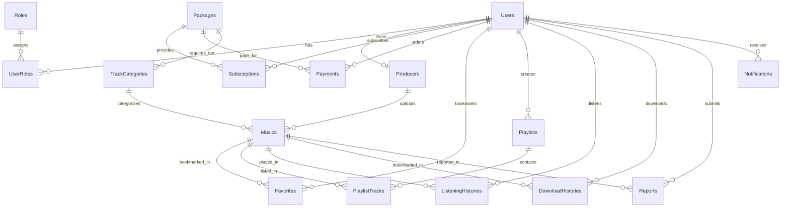

# 🎵 TLONGMUSIC - NỀN TẢNG MUSIC POOL & PHÂN PHỐI ÂM NHẠC DJ CHUYÊN NGHIỆP

<p align="center">
  
</p>

<p align="center">
  <strong>Hệ thống phân phối và chia sẻ nhạc điện tử, Vinahouse, Remix & Nonstop đỉnh cao dành riêng cho DJ và Producer Việt Nam.</strong>
</p>

<p align="center">
  
  
  
  
  
  
</p>

---

## 📌 MỤC LỤC

1. [Giới thiệu tổng quan](#-giới-thiệu-tổng-quan)
2. [Tính năng nổi bật](#-tính-năng-nổi-bật)
3. [Mô hình Hội viên & Phân quyền nội dung](#-mô-hình-hội-viên--phân-quyền-nội-dung)
4. [Kiến trúc hệ thống & Công nghệ](#-kiến-trúc-hệ-thống--công-nghệ)
5. [Cấu trúc thư mục dự án](#-cấu-trúc-thư-mục-dự-án)
6. [Mô hình Cơ sở dữ liệu (Database Schema)](#-mô-hình-cơ-sở-dữ-liệu-database-schema)
7. [Hệ thống Xử lý Âm thanh tự động (Audio Pipeline)](#-hệ-thống-xử-lý-âm-thanh-tự-động-audio-pipeline)
8. [Tích hợp Cổng thanh toán VietQR](#-tích-hợp-cổng-thanh-toán-vietqr)
9. [Hướng dẫn cài đặt & Triển khai](#-hướng-dẫn-cài-đặt--triển-khai)
10. [Danh sách tài khoản kiểm thử](#-danh-sách-tài-khoản-kiểm-thử)
11. [Danh sách API & Endpoints chính](#-danh-sách-api--endpoints-chính)
12. [Đóng góp & Giấy phép](#-đóng-góp--giấy-phép)

---

## 🌟 GIỚI THIỆU TỔNG QUAN

**TLONGMUSIC** là nền tảng **Music Pool & Streaming** chuyên biệt cho cộng đồng DJ, Producer và người nghe nhạc điện tử (Vinahouse, Progressive House, Club, Electro, Festival Bounce, Trance...).

Dự án được xây dựng dựa trên đặc tả yêu cầu phần mềm chuẩn chỉnh (**`SRS_TlongMusic.docx`**), giải quyết các bài toán quan trọng trong giới âm nhạc DJ:
- **Phân loại chất lượng chuyên sâu:** Cung cấp thông số BPM, Musical Key (Camelot Wheel như `8A`, `11B`), thời lượng chính xác, tag thể loại và chất lượng âm thanh (**MP3 320kbps** đến **Master WAV 24-Bit / FLAC**).
- **Phân cấp bản quyền & quyền tải:** Phân rõ kho nhạc thành các cấp độ: **Lọt** (phổ thông/miễn phí), **Nhóm** (nội bộ hội viên), và **Slot** (đặt riêng sự kiện/độc quyền).
- **Cơ chế nghe thử bảo mật (Slot Demo Guard):** Tự động cắt và giới hạn 30 giây nghe thử đối với các bản nhạc Slot dành cho người dùng chưa nâng cấp VIP.
- **Tự động hóa thanh toán:** Nâng cấp gói dịch vụ tức thời thông qua chuyển khoản ngân hàng quét mã **VietQR** tự động đối soát.

---

## ⚡ TÍNH NĂNG NỔI BẬT

### 🎧 1. Dành cho Người Nghe & DJ (Member)
- **Trình phát nhạc chuyên nghiệp (Crystal Audio Player):** Trình phát cố định hỗ trợ thanh tiến trình sóng âm (waveform), điều khiển âm lượng, lặp bài, phát ngẫu nhiên, tự động chuyển bài kế tiếp.
- **Khám phá âm nhạc đa chiều:**
  - Bộ lọc bài hát theo Ngày đăng, Thể loại (Genre), Tốc độ (BPM), Tone bài nhạc (Key), Cấp độ truy cập (Lọt / Nhóm / Slot).
  - Bảng xếp hạng Top bài hát thịnh hành, Top lượt nghe, Top lượt tải về.
- **Kho Nonstop / Mixtape dài tập:** Chuyên trang Nonstop tối ưu tải và phát mượt mà các set nhạc dài từ 30 phút đến hàng giờ đồng hồ.
- **Cá nhân hóa:** Tạo và quản lý Playlist riêng, lưu danh sách Yêu thích (Favorites), lưu lịch sử nghe nhạc và tải xuống.
- **Báo cáo vi phạm (Report):** Người dùng có thể báo cáo các bài nhạc lỗi link, bản quyền hoặc spam đến ban quản trị.

### 🎛️ 2. Dành cho Nhà Sản Xuất (Producer Portal)
- **Kênh upload chuyên biệt (`/Producer/Upload`):**
  - Tải lên các file âm thanh chất lượng cao (hỗ trợ MP3, WAV dung lượng lên tới 500MB).
  - Khai báo metadata chi tiết: Nghệ danh, Thể loại, BPM, Key, Loại nhạc (Track / Nonstop), Cấp độ truy cập (Lọt / Nhóm / Slot).
- **Trang cá nhân Producer:** Trưng bày các tác phẩm đã phát hành, liên kết mạng xã hội (Facebook, Zalo), tiểu sử, và thông tin nhận donate/thù lao.

### 🛡️ 3. Dành cho Quản Trị Viên (Admin Dashboard)
- **Bảng điều khiển số liệu thống kê (`/Admin`):**
  - Tổng số người dùng, số nhà sản xuất, tổng bài nhạc.
  - Tổng lượt nghe toàn sàn, tổng lượt tải về, tổng doanh thu thực nhận.
  - Số lượng hội viên Standard VIP và Premium Master đang hoạt động.
- **Quản lý danh mục & phê duyệt âm nhạc:** Duyệt bài đăng mới, ẩn bài, xóa bài, chỉnh sửa thông số kỹ thuật.
- **Quản lý hội viên & Đơn hàng:**
  - Kích hoạt/gia hạn thủ công thời hạn gói cước cho thành viên khi cần.
  - Tra cứu lịch sử thanh toán, trạng thái giao dịch (`Pending`, `Success`, `Failed`).
- **Quản lý và cấp quyền Producer:** Tạo tài khoản và hồ sơ Producer mới trực tiếp từ Admin.
- **Xử lý Báo cáo (Reports):** Duyệt các phản ánh bài hát từ người dùng.

---

## 💎 MÔ HÌNH HỘI VIÊN & PHÂN QUYỀN NỘI DUNG

Hệ thống quản lý nội dung theo ma trận phân quyền ma thuật 3 bậc:

```
┌───────────────────┬──────────────┬────────────────────────┬──────────────────────────────────┐
│ Gói Hội Viên       │ Màu sắc nhận │ Quyền Nghe             │ Quyền Tải Xuống                  │
│ (Subscription)    │ diện (Theme) │                        │ (Download Access)                │
├───────────────────┼──────────────┼────────────────────────┼──────────────────────────────────┤
│ Free Member       │ Mặc định     │ • Track Lọt, Nonstop Lọt│ • Tải miễn phí Track/Nonstop Lọt │
│                   │ (Xám / Xanh) │ • Demo 30s Nhạc Cấp Cao│ • KHÔNG tải được Nhóm & Slot    │
├───────────────────┼──────────────┼────────────────────────┼──────────────────────────────────┤
│ Standard VIP      │ Đỏ Ruby      │ • Toàn bộ Lọt & Nhóm   │ • Tải KHÔNG GIỚI HẠN:            │
│ (99.000đ / tháng) │ (Ruby Red)   │ • Demo 30s Track Slot  │   Track Lọt + Track Nhóm + Nonstop│
│                   │              │                        │ • Chất lượng: Studio MP3 320kbps │
├───────────────────┼──────────────┼────────────────────────┼──────────────────────────────────┤
│ Premium Master    │ Vàng Hoàng Gia│ • TOÀN BỘ KHO NHẠC     │ • ĐẶC QUYỀN CAO NHẤT:            │
│ (199.000đ / tháng)│ (Royal Gold) │ • Không giới hạn Demo  │   Tải trọn bộ Track & Nonstop    │
│                   │              │                        │   Lọt, Nhóm, và Slot độc quyền   │
│                   │              │                        │ • Chất lượng: Master WAV 24-Bit  │
└───────────────────┴──────────────┴────────────────────────┴──────────────────────────────────┘
```

---

## 💻 KIẾN TRÚC HỆ THỐNG & CÔNG NGHỆ

```
                          ┌───────────────────────────┐
                          │   Client Browser (UI)     │
                          │ HTML5 + Bootstrap 5 + JS │
                          │  Ruby Shimmer Theme       │
                          └─────────────┬─────────────┘
                                        │ HTTP / JSON API
                                        ▼
                   ┌──────────────────────────────────────────┐
                   │       ASP.NET Core 8.0 MVC / API         │
                   │──────────────────────────────────────────│
                   │ • Authentication: Cookie Auth & Claims   │
                   │ • Controllers: Home, Track, Nonstop,     │
                   │   Payment, Producer, Admin, Auth, Music  │
                   │ • Large File Kestrel Upload (Max 500MB)  │
                   └───────┬──────────────────────────┬───────┘
                           │                          │
              Entity Framework Core 8                 │ Media Foundation / NAudio
                           ▼                          ▼
         ┌───────────────────────────┐      ┌───────────────────────────┐
         │     SQL Server Database   │      │ Audio Processing Pipeline │
         │   (16 Relational Tables)  │      │ • Auto 320kbps MP3        │
         │  Vietnamese_CI_AS Collat  │      │ • Lossless Master WAV PCM │
         └───────────────────────────┘      │ • Slot 30s Demo Slicer    │
                                            └───────────────────────────┘
```

### Công nghệ sử dụng:
- **Backend Framework:** .NET 8.0 (C#) ASP.NET Core MVC & RESTful API
- **ORM:** Entity Framework Core 8.0.11 (Code First & Reverse Engineering)
- **Database:** Microsoft SQL Server (LocalDB / Express / Enterprise)
- **Audio Processing:**
  - `NAudio 2.2.1` & `NAudio.Lame 2.1.0`
  - Windows Media Foundation API native encoding
- **Bảo mật:**
  - Cookie Authentication (Persistent 30 ngày, Sliding Expiration)
  - Hash mật khẩu chuẩn SHA-256 kèm Salt
  - Role-based Access Control (Admin, Producer, Member)
  - Ngăn chặn tải file trực tiếp qua URL tĩnh (Route kiểm soát quyền tải `MusicController.Download`)
- **Frontend & Giao diện:**
  - Razor Views (`.cshtml`)
  - Bootstrap 5.3 + FontAwesome 6 Pro icons
  - Thiết kế phong cách **Ruby Crystal & Glassmorphism** (Hiệu ứng cực quang Aurora + Canvas bụi sao Stardust lấp lánh)
  - Responsive hoàn hảo trên Mobile, Tablet, Laptop, Màn hình Ultrawide

---

## 📂 CẤU TRÚC THƯ MỤC DỰ ÁN

```plaintext
d:/Code/WEB NGHE NHẠC/
│
├── Common/                          # Các lớp tiện ích dùng chung
│   └── SecurityHelper.cs            # Băm mật khẩu và đối soát mã hóa SHA-256
│
├── Controllers/                     # Bộ điều hướng xử lý nghiệp vụ (MVC & API)
│   ├── AdminController.cs           # Quản lý hệ thống, thống kê, duyệt nhạc, cấp VIP
│   ├── AuthController.cs            # Đăng nhập, Đăng ký, Đăng xuất, Lấy Session
│   ├── HomeController.cs            # Trang chủ, Trang cá nhân, Bảng xếp hạng
│   ├── MusicController.cs           # Stream nhạc, Download nhạc, Play count, Yêu thích
│   ├── NonstopController.cs         # Chuyên mục Nonstop & Mixtape chất lượng cao
│   ├── PaymentController.cs         # Tạo đơn hàng VietQR, Webhook và xác nhận chuyển khoản
│   ├── ProducerController.cs        # Kênh tải bài hát và quản lý dành cho Producer
│   └── TrackController.cs           # Khám phá kho Track, lọc BPM, Key, Thể loại
│
├── Data/                            # Tầng dữ liệu & DbContext
│   └── TLongMusicDbContext.cs       # 16 DbSets, Fluent API cấu hình ràng buộc quan hệ
│
├── Database/                        # Kịch bản cơ sở dữ liệu
│   └── TLongMusic_InitDatabase_SRS.sql # Script khởi tạo 16 bảng và Seeding mẫu chuẩn SRS
│
├── Models/                          # Thực thể và Data Transfer Objects
│   ├── Dto/
│   │   └── ApiDtos.cs               # DTO đăng nhập, đăng ký, upload, webhook, thống kê
│   ├── Entities/
│   │   └── DbEntities.cs            # 16 Models thực thể CSDL (User, Music, Package,...)
│   ├── ErrorViewModel.cs            # Model xử lý lỗi
│   └── Track.cs                     # Model phụ trợ hiển thị bài nhạc
│
├── Services/                        # Các dịch vụ xử lý nền
│   └── AudioProcessingService.cs    # Tự động nén 320k MP3 & xuất Master WAV qua NAudio
│
├── Views/                           # Giao diện người dùng Razor Views
│   ├── Admin/Index.cshtml           # Giao diện quản trị Admin chuyên sâu
│   ├── Home/                        # Trang chủ & Trang hồ sơ người dùng
│   ├── Member/                      # Trang quản lý thành viên
│   ├── Nonstop/Index.cshtml         # Danh sách và bộ lọc Nonstop
│   ├── Payment/Checkout.cshtml      # Trang quét mã VietQR nâng cấp VIP
│   ├── Producer/Upload.cshtml       # Giao diện tải nhạc cho Producer
│   ├── Track/Index.cshtml           # Danh sách và bộ lọc Track DJ
│   └── Shared/
│       ├── _Layout.cshtml           # Layout chính (Navbar, Footer, Audio Player, Theme)
│       └── Error.cshtml
│
├── wwwroot/                         # Tài nguyên tĩnh công khai
│   ├── css/site.css                 # Bộ style CSS Ruby Crystal Shimmer Glassmorphism
│   ├── js/site.js                   # Xử lý AJAX, Web Audio Player, Toast Notifications
│   ├── uploads/                     # Thư mục lưu trữ bài nhạc và ảnh đại diện
│   │   ├── music/                   # File âm thanh gốc, file 320k và file master wav
│   │   └── covers/                  # Ảnh bìa album / bài hát
│   └── images/                      # Logo thương hiệu và icon
│
├── appsettings.json                 # Chuỗi kết nối Database và cấu hình hệ thống
├── Program.cs                       # Khởi tạo Web Host, DI, Middleware, Kestrel Config
├── SRS_TlongMusic.docx              # Tài liệu đặc tả yêu cầu phần mềm gốc của dự án
└── TLongMusic.csproj                # File cấu hình thư viện và phiên bản .NET 8.0
```

---

## 🗄️ MÔ HÌNH CƠ SỞ DỮ LIỆU (DATABASE SCHEMA)

Cơ sở dữ liệu **`TLongMusicDb`** được chuẩn hóa theo bậc 3NF bao gồm **16 bảng quan hệ**:



### Chi tiết các bảng:
1. **Roles:** Lưu danh mục vai trò (`Admin`, `Producer`, `Member`).
2. **Users:** Thông tin tài khoản người dùng, email, mật khẩu băm, số điện thoại, tài khoản ngân hàng.
3. **UserRoles:** Bảng trung gian liên kết phân quyền nhiều-nhiều giữa User và Role.
4. **Producers:** Hồ sơ nhà sản xuất âm nhạc (Nghệ danh `StageName`, tiểu sử, hotline, Zalo, STK nhận tiền).
5. **Packages:** Danh mục gói dịch vụ (`Free`, `Standard`, `Premium`) kèm giá và quyền hạn tải.
6. **Subscriptions:** Lịch sử đăng ký và thời hạn sử dụng gói của người dùng.
7. **Payments:** Lịch sử đơn hàng, mã đơn `OrderCode`, số tiền, trạng thái thanh toán VietQR.
8. **TrackCategories:** Danh mục phân loại 6 nhóm (`TrackLot`, `NonstopLot`, `TrackNhom`, `NonstopNhom`, `TrackSlot`, `NonstopSlot`).
9. **Musics:** Kho bài hát/bản mix (Tiêu đề, Nghệ sĩ, BPM, Key, Thể loại, Đường dẫn file, Lượt nghe, Lượt tải).
10. **Favorites:** Danh sách bài hát ưa thích của từng người dùng.
11. **Playlists:** Danh sách phát do người dùng tự tạo.
12. **PlaylistTracks:** Chi tiết bài hát và thứ tự phát trong từng Playlist.
13. **ListeningHistories:** Nhật ký lượt nghe (phục vụ thống kê và bảng xếp hạng).
14. **DownloadHistories:** Nhật ký lượt tải về (chất lượng, gói tài khoản, địa chỉ IP).
15. **Reports:** Phản hồi bài hát vi phạm từ cộng đồng đến Admin.
16. **Notifications:** Thông báo hệ thống gửi đến người dùng (thanh toán thành công, gia hạn gói,...).

---

## 🔊 HỆ THỐNG XỬ LÝ ÂM THANH TỰ ĐỘNG (AUDIO PIPELINE)

Hệ thống được trang bị dịch vụ nền **`AudioProcessingService`**:
- **Khởi động cùng ứng dụng:** Kiểm tra toàn bộ file âm thanh hiện có trong thư mục `wwwroot/uploads/music` và nâng cấp tự động.
- **Tự động chuyển mã 2 luồng:**
  1. **Standard Bitrate:** Tự động encode file nguồn thành `[MusicId]_320k.mp3` sử dụng **Windows Media Foundation** (fallback `NAudio.Lame`) với Constant Bitrate 320 kbps chất lượng cao.
  2. **Master Lossless:** Tự động tạo bản Master `[MusicId]_master.wav` định dạng PCM Stereo nguyên bản không suy hao.
- **Bảo vệ bản quyền bài hát (Slot Guard):**
  - Khi người dùng Free hoặc Standard mở nghe bản nhạc thuộc danh mục **Slot**, hệ thống chỉ cho phép phát đoạn Demo tối đa 30s.
  - Đường dẫn file gốc không bao giờ lộ ra ngoài giao diện; toàn bộ luồng phát và tải về đều đi qua Controller kiểm tra phiên xác thực `UserTier`.

---

## 💳 TÍCH HỢP CỔNG THANH TOÁN VIETQR

Dự án áp dụng mô hình thanh toán quét mã QR chuẩn ngân hàng Việt Nam:
1. Người dùng bấm **Nâng cấp VIP** tại bảng giá (`/Payment/Checkout?packageId=Standard`).
2. Hệ thống sinh mã đơn ngẫu nhiên duy nhất: `TL` + `6 chữ số ngẫu nhiên` (ví dụ: `TL839201`).
3. Sinh link ảnh QR động theo chuẩn VietQR:
   ```
   https://img.vietqr.io/image/<BANK_ID>-<ACCOUNT_NO>-compact2.png?amount=<PRICE>&addInfo=<ORDER_CODE>&accountName=<HOLDER>
   ```
4. Hệ thống hỗ trợ 2 cơ chế đối soát:
   - **Xác nhận tự động qua Webhook:** Endpoint `POST /Payment/Webhook` nhận thông báo từ ngân hàng/cổng thanh toán, tự động kích hoạt gói `Active` và cộng 30 ngày sử dụng.
   - **Xác nhận tức thì qua mã đơn:** Endpoint `POST /Payment/ConfirmPayment` cho phép kiểm tra đơn hàng theo `OrderCode`.

---

## 🚀 HƯỚNG DẪN CÀI ĐẶT & TRIỂN KHAI

### 1. Yêu cầu môi trường
- Hệ điều hành: Windows 10/11 hoặc Windows Server (Khuyến nghị cho Media Foundation)
- SDK: **.NET 8.0 SDK** (hoặc mới hơn)
- Cơ sở dữ liệu: **Microsoft SQL Server 2019 / 2022** hoặc **SQL Server Express**
- Công cụ phát triển: Visual Studio 2022 / VS Code / JetBrains Rider

### 2. Khởi tạo Cơ sở dữ liệu
1. Mở công cụ **SQL Server Management Studio (SSMS)** hoặc **Azure Data Studio**.
2. Kết nối tới máy chủ SQL Server của bạn.
3. Mở và thực thi toàn bộ nội dung file kịch bản SQL:
   ```plaintext
   Database/TLongMusic_InitDatabase_SRS.sql
   ```
   *Kịch bản này sẽ tạo cơ sở dữ liệu `TLongMusicDb` và nạp sẵn 16 bảng cùng dữ liệu mẫu chuẩn nghiệp vụ.*

### 3. Cấu hình Chuỗi kết nối
Mở file `appsettings.json` và điều chỉnh chuỗi kết nối phù hợp với máy của bạn:

```json
{
  "ConnectionStrings": {
    "DefaultConnection": "Server=localhost;Database=TLongMusicDb;Trusted_Connection=True;TrustServerCertificate=True;",
    "MyCnn": "Server=localhost;Database=TLongMusicDb;Trusted_Connection=True;TrustServerCertificate=True;"
  },
  "Logging": {
    "LogLevel": {
      "Default": "Information",
      "Microsoft.AspNetCore": "Warning"
    }
  },
  "AllowedHosts": "*"
}
```
*(Nếu bạn dùng tài khoản `sa` có mật khẩu, hãy cập nhật `uid=sa;password=MậtKhẩuCủaBạn`)*

### 4. Khôi phục gói thư viện và Chạy ứng dụng
Mở Terminal / PowerShell tại thư mục dự án và chạy các lệnh sau:

```bash
# Khôi phục các thư viện NuGet
dotnet restore

# Build kiểm tra mã nguồn
dotnet build

# Chạy ứng dụng
dotnet run
```

Sau khi ứng dụng khởi chạy thành công, truy cập trình duyệt tại địa chỉ:
- **HTTPS:** `https://localhost:7088` (hoặc cổng hiển thị trên console)
- **HTTP:** `http://localhost:5088`

---

## 👤 DANH SÁCH TÀI KHOẢN KIỂM THỬ

Tất cả các tài khoản thử nghiệm đã được nạp sẵn mật khẩu mặc định là: **`123456`**

| Vai Trò | Tên Đăng Nhập | Email | Đặc Quyền & Tính Năng Trải Nghiệm |
| :--- | :--- | :--- | :--- |
| 🛡️ **Quản Trị Viên (Admin)** | `admin` | `admin@tlongmusic.vn` | Truy cập toàn quyền Admin Dashboard (`/Admin`), xem doanh thu, duyệt bài, gia hạn VIP |
| 🎛️ **Nhà Sản Xuất (Producer)** | `producer_tlong` | `producer@tlongmusic.vn` | Kênh tải nhạc riêng (`/Producer/Upload`), trang nghệ sĩ DJ TLong Official |
| 💎 **Hội Viên Premium Master** | `user_premium` | `premium@tlongmusic.vn` | Tải không giới hạn cả 3 cấp (Lọt, Nhóm, Slot), tải Master WAV Lossless 24-Bit |
| 🔴 **Hội Viên Standard VIP** | `user_standard` | `standard@tlongmusic.vn` | Tải không giới hạn Track Nhóm & Lọt (MP3 320k), nghe thử 30s với bài Slot |
| 🟢 **Người Dùng Thường (Free)** | `user_free` | `free@tlongmusic.vn` | Nghe và tải Track Lọt miễn phí, nghe thử 30s với bài Nhóm & Slot |

---

## 📡 DANH SÁCH API & ENDPOINTS CHÍNH

### 1. Xác thực & Tài khoản (`/Auth`)
- `POST /Auth/Login`: Đăng nhập hệ thống (tạo phiên Cookie Claims).
- `POST /Auth/Register`: Đăng ký tài khoản hội viên mới.
- `GET /Auth/Session`: Lấy thông tin phiên người dùng hiện tại và cấp độ VIP.
- `POST /Auth/Logout`: Đăng xuất khỏi hệ thống.
- `PUT /Auth/Profile`: Cập nhật thông tin cá nhân và tài khoản nhận tiền.

### 2. Âm nhạc & Phát trực tuyến (`/Music`)
- `GET /Music/Play/{id}`: Phát trực tuyến bài hát (kiểm tra hạn mức Demo 30s đối với bài Slot).
- `GET /Music/Download/{id}?quality=320k|wav`: Tải xuống file bài hát theo đặc quyền gói.
- `POST /Music/ToggleFavorite/{id}`: Bật/tắt trạng thái bài hát yêu thích.
- `GET /Music/MyFavorites`: Lấy danh sách bài hát đã thả tim của tài khoản.

### 3. Thanh toán & Nâng cấp VIP (`/Payment`)
- `POST /Payment/CreateOrder`: Khởi tạo đơn hàng nâng cấp gói và sinh mã VietQR.
- `POST /Payment/ConfirmPayment`: Xác nhận giao dịch thành công theo mã đơn.
- `POST /Payment/Webhook`: Webhook tự động nhận thông báo biến động số dư.

### 4. Quản trị hệ thống (`/Admin`)
- `GET /Admin/Stats`: Lấy toàn bộ số liệu thống kê Dashboard.
- `GET /Admin/Producers`: Danh sách nhà sản xuất.
- `POST /Admin/Producers`: Tạo mới một tài khoản Producer.
- `POST /Admin/ExtendSubscription`: Gia hạn/cấp gói VIP thủ công cho hội viên.
- `GET /Admin/Musics`: Danh sách quản lý bài hát toàn sàn.
- `DELETE /Admin/Musics/{id}`: Xóa hoặc gỡ bỏ bài hát.

### 5. Nhà sản xuất (`/Producer`)
- `POST /Producer/Upload`: Tải lên bài hát mới kèm file âm thanh và ảnh bìa.
- `GET /Producer/MyTracks`: Danh sách bài hát do chính Producer tải lên.

---

## 📜 ĐÓNG GÓP & GIẤY PHÉP

Dự án **TLONGMUSIC** được phát triển nhằm mục đích phục vụ cộng đồng DJ & Producer âm nhạc Việt Nam. Mọi đóng góp, báo lỗi hoặc đề xuất cải tiến tính năng vui lòng gửi yêu cầu Pull Request hoặc liên hệ ban quản trị.

- **Tác giả:** Long Đẹp Trai & Đội ngũ Phát triển TLongMusic
- **Phiên bản:** 1.0.0 Release (Chuẩn SRS)
- **Bản quyền:** © 2026 TLONGMUSIC. Bảo lưu mọi quyền.
